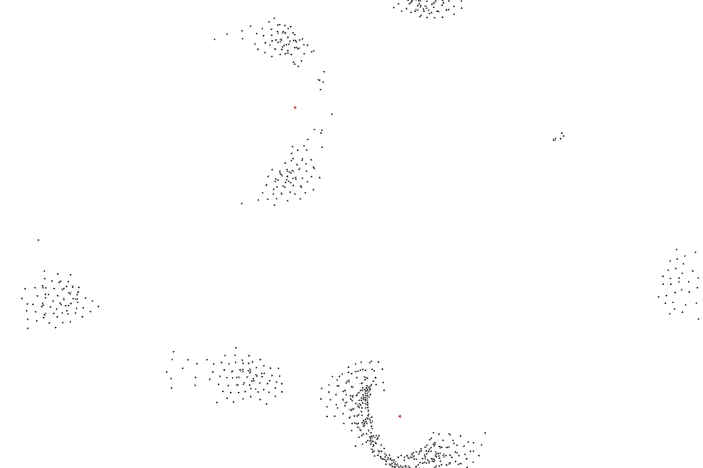

[1]: https://team.inria.fr/imagine/files/2014/10/flocks-hers-and-schools.pdf
[2]: https://www.sfml-dev.org

# Boids

Boids is a program developed by Craig Reynolds in 1986, which simulates the flocking behaviour of birds. He published
this model in 1987 in the seminal paper ["Flocks, Herds, and Schools: A Distributed Behavioral Model"][1].

The motion of a flock of birds is an example of emergent behavior -- each bird is only making individual
decisions, yet the motion of the entire flock is fluid and synchronized. Somehow, organized group behavior is able
to emerge as the aggregate of the local actions of each individual animal.

Boids simulates this individual decision making with three rules:

 1. **Separation:** individuals try to avoid crowding their nearby flockmates
 2. **Alignment:** individuals steer towards the average heading of nearby flockmates
 3. **Cohesion:** individuals try to move towards the center of mass of nearby flockmates
 
This repository contains an implementation of the boids model in C++.



## Usage

This project depends on [SFML][2], which must be installed first.

After installing SFML, the executable for the program can be built and installed from by running the script
`build_and_install.sh`. This program can then be run with:
```shell script
./bin/boids
```

Almost all aspects of the simulation and the boids' behavior can be customized from the command line. Pass the 
`--help` flag to see available options.

The simulation is also interactive. Left-clicking on the screen will add a new boid, and right-clicking will add a new
predator boid (normal boids will try to avoid these).